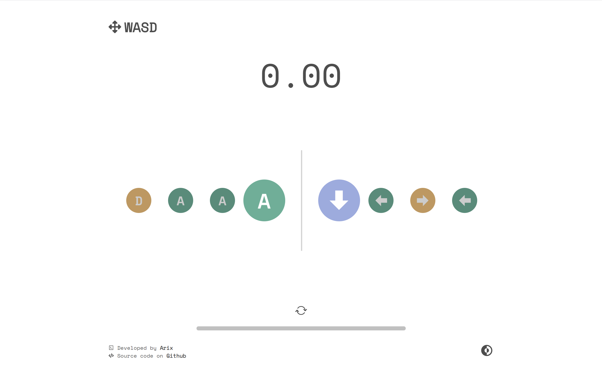

# Ufocus

## Overview

UFocus is an engaging two-handed focus and typing game designed to challenge users' coordination and concentration. The objective of the game is to have the user simultaneously press two different keys—one with each hand—as displayed on the screen. By requiring the player to coordinate both hands independently, UFocus promotes enhanced cognitive function, fine motor skills, and multitasking abilities. This project is not only a fun way to practice typing but also serves as a unique training tool for individuals looking to improve their hand-eye coordination and split attention capabilities.

## Libraries/Technologies Used
- React
- Styled Components
- Netlify

## Functionality

